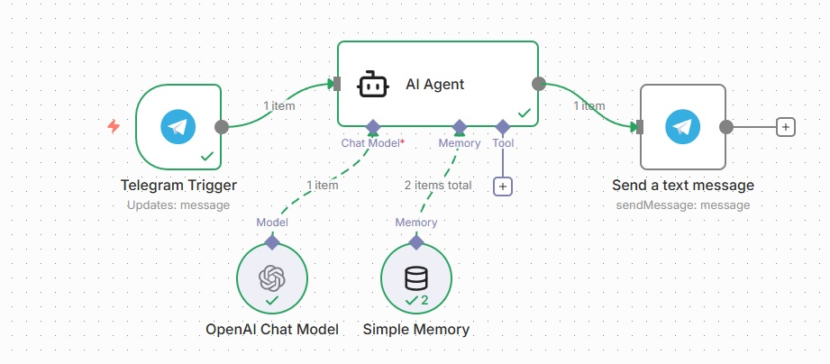

# n8n-telegram-bot-example

🤖 Пример Telegram бота на n8n с искусственным интеллектом. Бот выступает в роли консультанта и помогает подбирать курсы (на примере школы выпечки блинов). Показывает интеграцию Telegram + OpenAI, работу с памятью диалогов и системным промптом. Используйте как шаблон для своих проектов — просто замените промпт и каталог!

<div align="center">
  
  
  
</div>

---

## 📋 О проекте

Этот репозиторий содержит готовый шаблон n8n workflow для создания Telegram бота с AI-агентом. Бот помогает пользователям подобрать идеальный курс по выпечке блинов, учитывая их уровень подготовки и цели.

### ✨ Возможности

- 🧠 **AI диалоги** — использует OpenAI GPT
- 📊 **Определение уровня** — от новичка до профи
- 🎯 **Выявление целевых клиентов** — кто готов купить
- 📚 **Рекомендации курсов** — из 5 программ
- 💬 **Работа с возражениями** — о цене и сложности
- 🧠 **Память диалога** — помнит контекст

---

## 🗺️ Структура



### Компоненты:

| Узел | Назначение |
|------|------------|
| **Telegram Trigger** | Получает сообщения от пользователей |
| **AI Agent** | Основной мозг бота с системным промптом |
| **Simple Memory** | Хранит историю диалога (20 сообщений) |
| **OpenAI Chat Model** | Подключает языковую модель GPT |
| **Send Message** | Отправляет ответ обратно в Telegram |


---

## 📁 Каталог курсов (пример)

| Курс | Уровень | Уроков | Цена |
|------|---------|--------|------|
| 🥞 Идеальный первый блин | Начинающий | 4 | 1990 ₽ |
| 🥛 Блины на кислом молоке | Начинающий+ | 5 | 2490 ₽ |
| 🌾 Блины без глютена | Средний | 6 | 2990 ₽ |
| 🎨 Блинные кружева | Продвинутый | 4 | 2790 ₽ |
| 🔥 Французские крепы | Эксперт | 7 | 3490 ₽ |

---

## 🚀 Быстрый старт

### Требования
- Аккаунт [Amvera]([https://n8n.io/](https://cloud.amvera.ru/)
- Telegram бот (через [@BotFather](https://t.me/botfather))
- API ключ [OpenAI](https://platform.openai.com/)

### Установка

1. **Импортируйте в n8n**
   - Откройте n8n
   - Нажмите **Import from File**
   - Выберите файл `n8n_telegram_ai_template.json`

2. **Настройте учетные данные**
   - **Telegram**: добавьте токен бота
   - **OpenAI**: добавьте API ключ

3. **Замените системный промпт**
   - В узле **AI Agent** найдите `YOUR_SYSTEM_PROMPT_HERE`
   - Вставьте свой текст

4. **Активируйте workflow**
   - Нажмите кнопку **Active** в правом верхнем углу

5. **Пишите своему боту в Telegram!** 🎉

---

### 📝 Пример системного промпта

Не знаете, что написать? Используйте наш пример:

```markdown
Ты — консультант кулинарной школы. Помогаешь подобрать курс по выпечке блинов.
Определяешь уровень ученика (новичок/профи) и рекомендуешь подходящий курс из каталога.
Общайся тепло, с эмодзи, но по делу.


