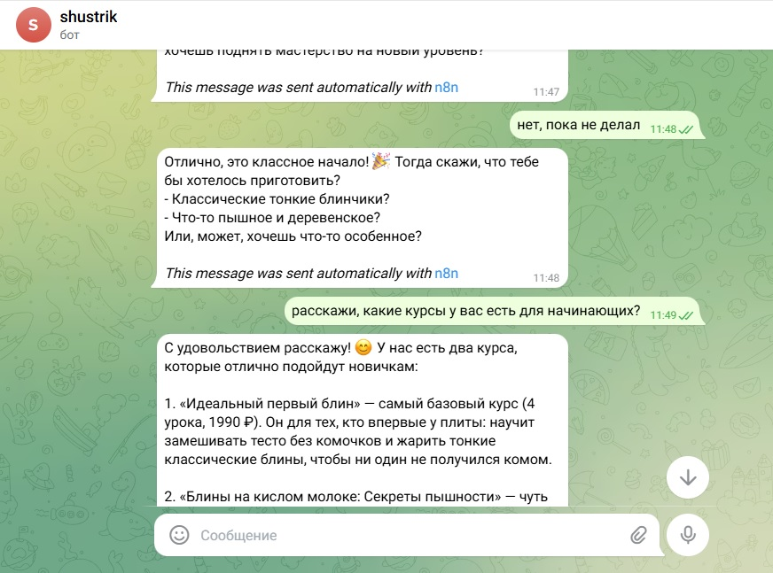

# n8n-telegram-bot-example

🤖 Пример Telegram бота на n8n с искусственным интеллектом. Бот выступает в роли консультанта и помогает подбирать курсы (на примере школы выпечки блинов). Показывает интеграцию Telegram + OpenAI, работу с памятью диалогов и системным промптом. Используйте как шаблон для своих проектов — просто замените промпт и каталог!

  
  
  

---

## 📋 Содержание

## 📋 Содержание

- [📋 О проекте](#-о-проекте)
- [✨ Возможности](#-возможности)
- [🗺️ Структура](#️-структура)
- [📦 Артефакты проекта](#-артефакты-проекта)
- [📁 Каталог курсов](#-каталог-курсов-пример)
- [🚀 Быстрый старт](#-быстрый-старт)
- [🛠️ Адаптация](#️-адаптация-под-свой-проект)
- [🔒 Безопасность](#-безопасность)
- [💬 Пример диалога](#-пример-диалога)
- [🚀 Что дальше?](#-что-дальше)
- [💼 Готовый бот для вашего бизнеса](#-готовый-бот-для-вашего-бизнеса)
- [🥞 Присоединяйся](#-присоединяйся-к-блинной-тусовке)

---

## 📋 О проекте

Этот репозиторий содержит готовый шаблон n8n workflow для создания Telegram бота с AI-агентом. Бот помогает пользователям подобрать идеальный курс по выпечке блинов, учитывая их уровень подготовки и цели.

### ✨ Возможности

- 🧠 **AI диалоги** — использует OpenAI GPT
- 📊 **Определение уровня** — от новичка до профи
- 🎯 **Выявление целевых клиентов** — кто готов купить
- 📚 **Рекомендации курсов** — из 5 программ
- 💬 **Работа с возражениями** — о цене и сложности
- 🧠 **Память диалога** — помнит контекст

---

## 🗺️ Структура

### Компоненты:

| Узел | Назначение |
|------|------------|
| **Telegram Trigger** | Получает сообщения от пользователей |
| **AI Agent** | Основной мозг бота с системным промптом |
| **Simple Memory** | Хранит историю диалога (20 сообщений) |
| **OpenAI Chat Model** | Подключает языковую модель GPT |
| **Send Message** | Отправляет ответ обратно в Telegram |

---

## 📦 Артефакты проекта

| Файл | Назначение |
|------|------------|
| **📄 Workflow** | |
| [`n8n_telegram_ai_template.json`](n8n_telegram_ai_template.json) | Основной workflow для n8n |
| **📄 Документация** | |
| [`system_prompt.txt`](system_prompt.txt) | Системный промпт для AI Agent |
| **🖼️ Изображения** | |
| [`n8n-workflow-preview.jpg`](n8n-workflow-preview.jpg) | Скриншот структуры workflow |
| [`bot-conversation-example.jpg`](bot-conversation-example.jpg) | Пример диалога с ботом |

---

## 📁 Каталог курсов (пример)

| Курс | Уровень | Уроков | Цена |
|------|---------|--------|------|
| 🥞 Идеальный первый блин | Начинающий | 4 | 1990 ₽ |
| 🥛 Блины на кислом молоке | Начинающий+ | 5 | 2490 ₽ |
| 🌾 Блины без глютена | Средний | 6 | 2990 ₽ |
| 🎨 Блинные кружева | Продвинутый | 4 | 2790 ₽ |
| 🔥 Французские крепы | Эксперт | 7 | 3490 ₽ |

---

## 🚀 Быстрый старт

### Требования
- Аккаунт [Amvera](https://cloud.amvera.ru/)
- Telegram бот (через [@BotFather](https://t.me/botfather))
- API ключ [OpenAI](https://platform.openai.com/)

### Установка

1. **Импортируйте в n8n**
   - Откройте n8n
   - Нажмите **Import from File**
   - Выберите файл [`n8n_telegram_ai_template.json`](n8n_telegram_ai_template.json)

2. **Настройте учетные данные**
   - **Telegram**: добавьте токен бота
   - **OpenAI**: добавьте API ключ

3. **Замените системный промпт**
   - В узле **AI Agent** найдите `YOUR_SYSTEM_PROMPT_HERE`
   - Вставьте свой текст

4. **Активируйте workflow**
   - Нажмите кнопку **Active** в правом верхнем углу

5. **Пишите своему боту в Telegram!** 🎉

---

## 🛠️ Адаптация под свой проект

1. Откройте узел **AI Agent**
2. Найдите поле `systemMessage`
3. Замените промпт на свой.
Можете взять наш системный промпт - [`system_prompt.txt`](system_prompt.txt), как пример, и отредактировать под свои нужды.
4. Готово!

---

## 🔒 Безопасность

Все чувствительные данные заменены плейсхолдерами:

| Плейсхолдер | Описание |
|-------------|----------|
| `YOUR_TELEGRAM_CREDENTIAL_ID` | ID учетных данных Telegram |
| `YOUR_OPENAI_CREDENTIAL_ID` | ID учетных данных OpenAI |
| `YOUR_WEBHOOK_ID` | ID вебхука |
| `YOUR_SYSTEM_PROMPT_HERE` | Ваш системный промпт |

**Никогда не публикуйте реальные токены!**

## 💬 Пример диалога

*Как бот помогает подобрать курс*

### Особенности диалога:
- ✅ Бот общается тепло, с эмодзи
- ✅ Задает уточняющие вопросы
- ✅ Не навязывает, а помогает выбрать
- ✅ Работает с возражениями

---

## 🚀 Что дальше?

Этот простой бот уже способен заменить менеджера по работе с клиентами 🤖, но его можно значительно улучшить:

### 💡 Идеи для развития

| Задача | Решение | Зачем |
|--------|---------|-------|
| **📞 Отслеживание диалогов** | Интеграция с [Wazzup](https://wazzup.ru/) | Хранить историю общения с клиентами в одном месте |
| **📊 Сбор лидов** | Подключение Google Sheets | Простая и бесплатная CRM для старта |
| **🏢 Полноценная CRM** | Интеграция с amoCRM / Битрикс24 | Автоматическое создание сделок и контактов |
| **🔔 Информирование о заказах** | Уведомления в Telegram / Email / SMS | Мгновенно узнавать о новых продажах |
| **📧 Email-рассылки** | Подключение Mailchimp / Unisender | Отправлять промокоды "теплым" лидам |
| **💰 Прием платежей** | ЮKassa / Stripe / Tinkoff API | Продавать курсы прямо в боте |
| **📱 Напоминания** | Email + SMS + Telegram | Информировать о новых курсах и акциях |

---

## 💼 Готовый бот для вашего бизнеса

### Нужен такой бот под ваш бизнес?

Разработка бота с нуля — это **40 000–100 000 ₽** и месяц ожидания.  
Я предлагаю готовое решение: беру этот шаблон и адаптирую под вашу задачу за **1–3 дня**. Вы получаете работающий AI-консультант по цене одного дня разработки.

### 🎯 Что вы получите

| Пакет | Что входит | Цена | Экономия |
|-------|------------|------|----------|
| **🟢 Старт** | • Смена тематики под ваш бизнес • Замена системного промпта • Обновление каталога товаров/услуг • Настройка под вашего Telegram бота | **7 900 ₽** | ≈ 90% vs разработка с нуля |
| **🟡 Бизнес** | • Всё из пакета Старт • Подключение Google Sheets для сбора лидов • Уведомления менеджеру в Telegram о новых заказах • Добавление 2–3 новых сценариев диалога | **19 900 ₽** | Экономия 40 000+ ₽ |
| **🔴 PRO** | • Всё из пакета Бизнес • Интеграция с CRM (amoCRM / Битрикс24) • Подключение платежей (ЮKassa / Tinkoff / Stripe) • Полная документация и обучение | **39 900 ₽** | Годовая зарплата разработчика в подарок 🎁 |

---

### 🤔 Почему это выгодно?

| Ваш вариант | Стоимость | Сроки | Риски |
|-------------|-----------|-------|-------|
| Нанимать разработчика | от 100 000 ₽ | 1–2 месяца | Может не взлететь |
| Покупать шаблон и ковырять самому | бесплатно | Неделя | Нужно разбираться в n8n |
| **Заказать адаптацию у меня** | **7 900 – 39 900 ₽** | **1–3 дня** | **Гарантия результата** |

---

### 🔥 Для каких ниш подходит

| Ниша | Как бот помогает |
|------|------------------|
| 🏋️ **Фитнес** | Подбирает программу тренировок |
| 📚 **Образование** | Рекомендует курсы по уровню |
| 💄 **Красота** | Помогает выбрать уход |
| 🍔 **Рестораны** | Консультирует по меню |
| 🏨 **Туризм** | Подбирает отели и туры |
| 🎓 **Коучинг** | Продаёт консультации |

---

### 📦 Что вы получите на выходе

✅ Готовый Telegram бот с AI  
✅ Полностью настроенный workflow в n8n  
✅ Импорт за 5 минут  
✅ Инструкция по использованию  
✅ Поддержка 7 дней после сдачи  

---

### 📱 Хотите так же?

Напишите мне в Telegram — обсудим вашу задачу, и я сделаю бота, который будет приносить заявки 24/7.

---

⏳ **Один день работы — и ваш бизнес получает круглосуточного менеджера без зарплаты и выходных**

---

## 🥞 Присоединяйся к блинной тусовке!

Проект живёт и развивается благодаря таким же энтузиастам, как ты!

### 🌟 Как поучаствовать

| Действие | Зачем |
|----------|-------|
| ⭐ **Поставить звезду** | Чтобы проект увидело больше людей |
| 🐛 **Найти баг** | Напиши issue, и мы всё починим |
| 💡 **Предложить идею** | Придумал фичу? Расскажи в Issues! |
| 🔧 **Отправить PR** | Умеешь кодить? Улучши проект сам |
| 📢 **Рассказать друзьям** | Чем больше нас, тем веселее |

### 🤝 Давай дружить

---

**Сделай свой первый PR или просто напиши "Привет!" в чат — будем рады!** 🥞

